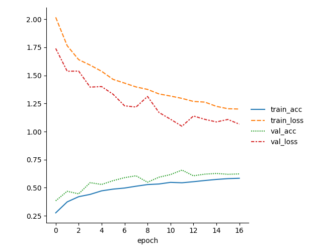
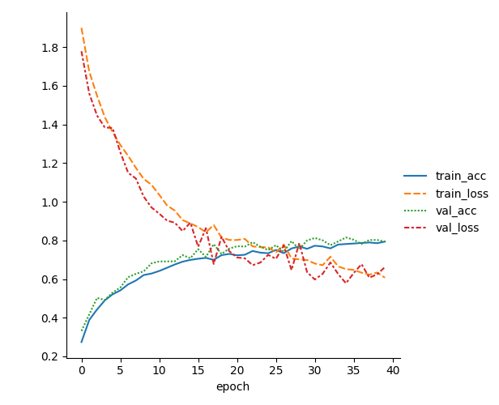

# Enhancing Transformer Attention with HDC Binding for Positional Encoding

This repository contains the code and resources for my Master's thesis, which explores the use of Hyperdimensional Computing (HDC)
binding methods to improve positional encoding in Transformer models. The project focuses primarily on time series classification,
with a potential extension to natural language processing (NLP) tasks.

Main experiments are:

- Different HDC binding methods (additive, component-wise multiplication, circular convolution) for positional encoding and embeddings
- Different similarity shapes for absolute position encoding

## Setup

For the detailed setup instructions for different PyTorch backends (CUDA, ROCM, XPU, MPS, CPU), please refer to the
[SETUP.md](docs/SETUP.md) file in the `docs` directory.

In short, the project uses [Poetry](https://python-poetry.org/) for dependency management and virtual environment,
you can install the project dependencies by creating a virtualenv environment with Python 3.11 or higher and running:

```bash
make install
```

## Project Overview

The standard approach to incorporating positional information in Transformers involves adding positional embeddings to token
embeddings. This project investigates an alternative approach: using HDC *binding* operations to combine positional and token
information. HDC binding offers a potentially more robust and expressive way to represent the relationship between a token
and its position within a sequence.

**Key Research Questions:**

* Can HDC binding methods improve the performance of Transformer models on time series classification tasks compared to
traditional additive positional encoding?
* How do different HDC binding methods (element-wise multiplication, circular convolution) compare in terms of
performance and computational efficiency?
* Can the benefits of HDC binding for positional encoding extend to other domains, such as NLP? (Secondary,
if time permits)
* Is it helpful to create the positional vector embeddings task specific?

**Theoretical Background:**

This project builds upon the following key concepts and research:

* **Transformers:** The fundamental architecture for sequence processing, as introduced in "Attention is all you need" (Vaswani et al., 2017) [1].
* **Positional Encoding:** Methods for incorporating positional information into Transformer models, including absolute and relative positional encoding.
* **Time Series Transformers:** Adaptations of the Transformer architecture for time series data, such as ConvTran (Foumani et al., 2024) [2],
which introduces Time Absolute Position Encoding (tAPE) and Efficient Relative Position Encoding (eRPE).
* **Hyperdimensional Computing (HDC):** A computational paradigm that uses high-dimensional vectors and specific algebraic
operations (binding, bundling, permutation) to represent and manipulate information.

**Project Goals:**

1. **Implement and Evaluate HDC Binding:** Implement and rigorously evaluate different HDC binding methods (element-wise
multiplication and circular convolution) for combining positional and token embeddings within a Transformer model.
2. **Time Series Classification:** Apply the developed models to a range of univariate and multivariate time series
datasets from the UCR/UEA archive.
3. **Comparison with Baselines:** Compare the performance of HDC-based positional encoding against strong baselines, including:
   * Vanilla Transformer with positional encoding adapted for time series.
   * ConvTran (Foumani et al., 2024) [2].
4. **Potential NLP Extension:** If time and resources allow, explore the application of HDC binding to a small-scale NLP
task (e.g., sentiment analysis, language modeling).
5. **Experimental Evaluation of Different Similarity Shapes in Absolute Position Encoding**

## Project Structure

```bash
│
├── artifacts               # 'git-ignored', stores data and trained models (not tracked by Git)
│     ├── data                # Datasets (e.g., UCR/UEA datasets)
│     └── models              # Saved model checkpoints
│
├── scripts                 # Scripts for installation
│
├── src                     # Source code
│     ├── utils                # Utility functions (e.g., logging, helper functions, experiment utilities)
│     ├── experiments          # Training and evaluation scripts
│     │     └── time_series          # Time series specific experiments
│     ├── test                 # Unit tests for the codebase
│     └── models               # Model definitions
│           ├── positional_encoding  # Implementations of different positional encoding methods (including HDC binding)
│           └── transformer          # Transformer architecture implementation
│
├── docs                    # Documentation files
│     └── SETUP.md          # Instructions for setting up the project environment
│
├── pyproject.toml          # Project configuration and dependencies (using Poetry)
├── README.md               # This file
└── Makefile                # Makefile for automating tasks (e.g., installation, training, testing, cleaning)
```

# Experiments

Main experiments are:

- Different HDC binding methods (additive, component-wise multiplication, circular convolution) for positional encoding and embeddings
- Different similarity shapes for absolute position encoding

## Different Binding Methods


### Insights

#### Component-wise Binding Operation:

Experiments with a normalization layer before the operation showed that the model performance is significantly worse than without normalization (~60% accuracy on average with it, and over ~70% without it). This is likely due to the fact that:
   * Sinusoidal Positional Encodings are designed to have a specific structure and magnitude. Normalizing them before the multiplication might disrupt this structure, making it harder for the model to learn the positional relationships

##### Sensitivity to Initialization

The performance is more sensitive to the initialization of the embeddings and positional encodings. Shown in fig. 1 & 2, despite using the same dataset, model and parameters, the model performs significantly different in both runs. This is likely due to the fact that the component-wise binding operation is more sensitive to the specific values of the embeddings and positional encodings, which can lead to different learning dynamics and convergence behavior.

<div align="center">

<p style="text-align: center"> Figure 1: Sensitivity to Initialization run 1</p>


<p style="text-align: center"> Figure 2: Sensitivity to Initialization run 2</p>
</div>
