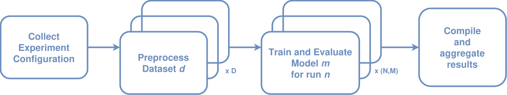

# Enhancing Transformer Attention with HDC Binding for Positional Encodings

[](https://github.com/JoseJuan98/transformer-attention-with-hdc-binding/actions/workflows/lint.yml)
[](https://github.com/JoseJuan98/transformer-attention-with-hdc-binding/actions/workflows/test.yml)

[](https://opensource.org/licenses/MIT)
[](https://www.python.org/downloads/)
[](https://pytorch.org/)

This repository contains the code and resources for my Master's thesis, which explores the use of Hyperdimensional Computing (HDC)
binding methods to enhance positional encoding in Transformer models. The project primarily focuses on time series classification (TSC),
with potential extensions to natural language processing (NLP) tasks.

> **Note:** For detailed information about the experiments conducted, please check the [experiments documentation](src/experiments/README.md).

## Table of Contents

1. [Introduction](#introduction)
2. [Core Idea: HDC for Positional Encoding](#core-idea-hdc-for-positional-encoding)
3. [Key Research Questions](#key-research-questions)
4. [Project Goals](#project-goals)
5. [Theoretical Background](#theoretical-background)
6. [Proposed Architecture](#proposed-architecture)
7. [Project Structure](#project-structure)
8. [Getting Started](#getting-started)
   * [Prerequisites](#prerequisites)
   * [Installation](#installation)
9. [Running Experiments](#running-experiments)
   * [Experiment Framework Overview](#experiment-framework-overview)
   * [Executing Experiments](#executing-experiments)
   * [Main Experiments Conducted](#main-experiments-conducted)
10. [Results](#results)
11. [References](#references)
12. [License](#license)
13. [Acknowledgements](#acknowledgements)

## Introduction

Transformers have become a dominant architecture for sequence processing tasks across various domains. A key component of these models is positional encoding, which injects information about the order of elements in a sequence. The standard approach involves additively combining positional embeddings with token embeddings.

This project investigates an alternative approach: using Hyperdimensional Computing (HDC) *binding* operations to combine positional and token information. HDC binding offers a potentially more robust and expressive way to represent the relationship between a token and its position, particularly for time series data where temporal relationships are crucial.

## Core Idea: HDC for Positional Encoding

Instead of simple addition, this work explores using HDC binding operations (e.g., component-wise multiplication, circular convolution) to integrate positional vectors with token embeddings. The hypothesis is that these operations can create richer, more discriminative representations of position-aware tokens, potentially addressing limitations of traditional positional encoding methods such as anisotropy in similarity spaces.


<div align="center">
    
    <p style="text-align: center">Figure 1: The impact of different binding operations on the position-wise cosine similarity structure of embeddings. Lighter colors indicate higher similarity. The top row shows the similarity of the input token embeddings ($E_{token}$) (a) and positional encodings ($E_{pos}$) (b). The bottom row shows the similarity of the resulting embeddings after applying additive (c), component-wise (d), and circular convolution (e) binding. Each operation produces a fundamentally different geometric structure.</p>
</div>

## Key Research Questions

1. How do different HDC binding methods (component-wise multiplication, circular convolution) compare to the standard additive method for combining positional and token embeddings in Transformer models for TSC?
2. Do the benefits of HDC binding methods vary with model depth ($N_L$)?
3. How does embedding dimensions ($d_{model}$) influence the effectiveness of different binding methods?
4. How does the shape of the similarity curve between PE affect the performance of Transformer models on TSC tasks?
5. Will convolutional input embeddings benefit less from sophisticated binding methods than linear embeddings?

## Project Goals

1. **Implement and Evaluate HDC Binding:** Implement and rigorously evaluate different HDC binding methods for combining positional and token embeddings within a Transformer model.
2. **Time Series Classification:** Apply the developed models to a diverse range of univariate and multivariate time series datasets from the UCR/UEA archive.
3. **Comparison with Baselines:** Compare the performance of HDC-based positional encoding against strong baselines, including:
   * Vanilla Transformer with standard positional encoding adapted for time series.
   * ConvTran (Foumani et al., 2024) [2], a state-of-the-art model for time series classification.
4. **Experimental Evaluation:** Systematically investigate the impact of different similarity shapes in absolute position encoding and their interaction with binding methods.
5. **Scalability Analysis:** Examine how the benefits of HDC binding scale with model capacity and depth.
6. **Potential NLP Extension:** If time and resources allow, explore the application of HDC binding to a small-scale NLP task.

## Theoretical Background

This project builds upon the following key concepts and research:

* **Transformers:** The fundamental architecture for sequence processing, as introduced in "Attention is all you need" (Vaswani et al., 2017) [1].
* **Positional Encoding:** Methods for incorporating positional information into Transformer models, including absolute and relative positional encoding schemes.
* **Time Series Transformers:** Adaptations of the Transformer architecture for time series data, such as ConvTran (Foumani et al., 2024) [2], which introduces Time Absolute Position Encoding (tAPE) and Efficient Relative Position Encoding (eRPE).
* **Hyperdimensional Computing (HDC):** A computational paradigm that uses high-dimensional vectors and specific algebraic operations (binding, bundling, permutation) to represent and manipulate information in a neurally-inspired manner.

## Proposed Architecture

The core model is a Transformer-based classifier adapted for time series classification, incorporating the novel HDC-based positional encoding mechanism. The architecture allows for systematic comparison of different embedding types, binding methods, and positional encoding schemes.

<div align="center">
    
    <p style="text-align: center">Figure 1: High-level design of the proposed time series transformer classifier architecture.</p>
</div>

## Project Structure

```bash
│
├── artifacts               # 'git-ignored', stores data and trained models (not tracked by Git)
│     ├── data                # Datasets (e.g., UCR/UEA datasets)
│     └── models              # Saved model checkpoints and metrics
│
├── scripts                 # Scripts for installation and verification of hardware backends
│
├── src                     # Source code
│     ├── models                # Model definitions
│     │     ├── architectures        # Time series specific models (e.g., encoder-only transformer classifier)
│     │     ├── binding       # HDC binding methods (e.g., addition, component-wise multiplication, circular convolution)
│     │     ├── callbacks            # Callbacks for training (e.g., early stopping, learning rate scheduling)
│     │     ├── embedding            # Embedding layers (e.g. linear projection, 1D convolution)
│     │     ├── positional_encoding  # Implementations of different positional encoding methods (including HDC binding)
│     │     └── transformer          # Transformer components implementation
│     │
│     ├── experiments           # Training and evaluation scripts
│     │     └── time_series          # Time series specific experiments
│     │
│     ├── experiment_framework  # Experiment framework for preparing the data, running experiments, and evaluating results
│     │     ├── config              # Configuration schemas, factories, and utilities
│     │     ├── data                # Data loading and preprocessing (e.g., UCR/UEA datasets)
│     │     └── runner              # Experiment runner (e.g.,training, metrics handling, error handling)
│     │
│     ├── test                  # Unit tests for the codebase
│     │
│     └── utils                 # Utility functions (e.g., logging, helper functions, experiment utilities)
│
├── docs                    # Documentation files
│     ├── metrics           # Experiment results and analysis
│     ├── diagrams          # Diagrams and architectural visualizations
│     └── SETUP.md          # Instructions for setting up the project environment
│
├── pyproject.toml          # Project configuration and dependencies (using Poetry)
├── README.md               # This file
└── Makefile                # Makefile for automating tasks (e.g., installation, training, testing, cleaning)
```


## Getting Started

### Prerequisites

* Python 3.11 or higher
* [Poetry](https://python-poetry.org/) for dependency management
* (Optional but Recommended) Hardware acceleration support:
  * NVIDIA GPU with CUDA
  * AMD GPU with ROCm
  * Intel GPU with XPU
  * Apple Silicon with MPS
  * CPU-only execution is also supported.

### Installation

1. Create virtual environment with Python 3.11 or higher (python 3.12 has been tested):
    ```bash
    python -m venv venv
    source venv/bin/activate  # On Windows use: venv\Scripts\activate
    ```

2. **Set up the environment and install dependencies.** The project uses Poetry. To install dependencies into a virtual environment:
    ```bash
    make install
    ```

3. **Detailed Backend Setup:** For specific instructions on setting up PyTorch with different hardware backends (CUDA, ROCm, XPU, MPS, CPU), please refer to the [SETUP.md](docs/SETUP.md) file.

## Running Experiments

### Experiment Framework Overview

The project includes a framework designed to streamline the process of data preparation, model training, and results evaluation.
Key features include:

* Configuration-driven experiment definition
* Automated logging and metrics collection
* Reproducibility through fixed random seeds
* Efficient data handling and hardware utilization
* Support for multiple hardware backends

<div style="text-align: center">
    
    <p style="text-align: center">Figure 2: High-level design of the experiment framework.</p>
</div>

### Executing Experiments

Experiments are managed via the `Makefile` and configuration files within the `src/experiments/` directory.

To select and run an time series classification experiment:
    ```bash
    make run-ts
    ```

Please refer to `src/experiments/README.md` or the individual script files for detailed instructions on available arguments and configurations options.

### Main Experiments Conducted

The research is structured around five main experimental investigations:

* Impact of Binding Methods and Input Embeddings: Comparing different binding methods (additive, multiplicative, circular convolution) with different input embedding types (linear projection, 1D convolution).
* Impact of Model Depth: Investigating how the effectiveness of different binding methods changes with increased model depth.
* Impact of Diverse Positional Encoding Schemes: Evaluating various positional encoding schemes with different similarity shapes (sinusoidal, split sinusoidal, random, fractional power encoding).
* Comparison with State-of-the-Art: Benchmarking the best configurations against established models like ConvTran.
* Impact of Model Capacity: Analyzing how the benefits of HDC binding scale with increasing model capacity.

## Results

Detailed experimental results, including performance metrics, comparisons, and analyses, can be found in the `docs/metrics/` directory.
The results include:

* Performance comparisons accross different binding methods
* Analysis of positional encoding schemes and their similarity shapes
* Abalation studies on model depth and capacity
* Statistical significance testing with condifence intervals

A summary of key findings will be updated here upon completion of all experimental phases.

## Things that I would like to improve

* **Metrics**: The current metrics are limited to accuracy and loss. It would be beneficial to include additional metrics such as precision, recall, F1-score, and confusion matrices for a more comprehensive evaluation of model performance.
* **Hyperparameter Tuning**: Create an experiment to seek higher model performance for the best configurations found by implementing automated hyperparameter tuning.
* **Unit Tests**: The current unit tests are limited. It would be beneficial to add more tests, and increase the coverage of the codebase to ensure robustness and reliability.

## References

[1] Vaswani, A., Shazeer, N., Parmar, N., Uszkoreit, J., Jones, L., Gomez, A. N., ... & Polosukhin, I. (2017). Attention is all you need. In *Advances in neural information processing systems* (pp. 5998-6008).

[2] Foumani, M. N., Koley, S., Oudah, M., & Ganna, A. (2024). ConvTran: A Convolutional Transformer for Time Series Classification. *arXiv preprint arXiv:2402.00486*.

## License

This project is licensed under the MIT License - see the [LICENSE](LICENSE) file for details.

## Acknowledgements

*   This work was conducted as part of my Master's thesis at [Luleå University of Technology](https://www.ltu.se/en).

[//]: # (#TODO:)
[//]: # (*   Thanks to [Advisor Name] for their guidance.)

[//]: # (*   ... any other acknowledgements ...)
