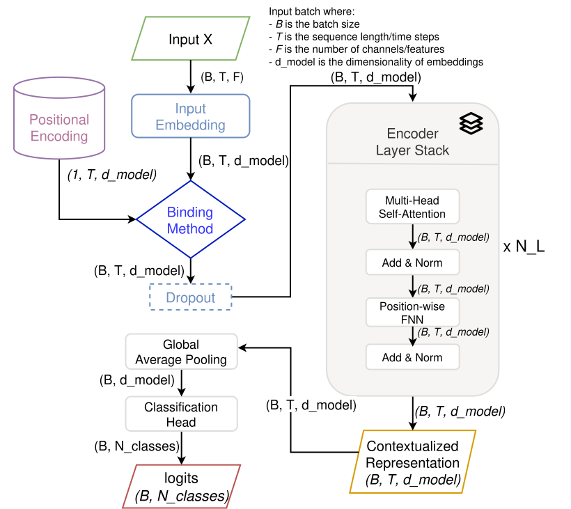

# Enhancing Transformer Attention with HDC Binding for Positional Encodings

[](https://opensource.org/licenses/MIT)
[](https://www.python.org/downloads/)
[](https://pytorch.org/)
<!-- Add other badges: e.g., build status, Python version, etc. -->

<!-- #TODO: add somewhere that to check the experiments carry out check the [experiments doc](src/experiments/README.md) -->

This repository contains the code and resources for my Master's thesis, which explores the use of Hyperdimensional Computing (HDC)
binding methods to improve positional encoding in Transformer models. The project primarily focuses on time series classification,
with potential extensions to natural language processing (NLP) tasks.

## Table of Contents

1.  [Introduction](#introduction)
2.  [Core Idea: HDC for Positional Encoding](#core-idea-hdc-for-positional-encoding)
3.  [Key Research Questions](#key-research-questions)
4.  [Project Goals](#project-goals)
5.  [Theoretical Background](#theoretical-background)
6.  [Proposed Architecture](#proposed-architecture)
7.  [Project Structure](#project-structure)
8.  [Getting Started](#getting-started)
    *   [Prerequisites](#prerequisites)
    *   [Installation](#installation)
9.  [Running Experiments](#running-experiments)
    *   [Experiment Framework Overview](#experiment-framework-overview)
    *   [Executing Experiments](#executing-experiments)
    *   [Main Experiments Conducted](#main-experiments-conducted)
10. [Results](#results)
11. [References](#references)
12. [License](#license)
13. [Acknowledgements (Optional)](#acknowledgements)

## Introduction

Transformers have become a dominant architecture for sequence processing tasks. A key component is positional encoding, which injects information about the order of elements in a sequence. The standard approach involves adding positional embeddings to token embeddings.

This project investigates an alternative: using Hyperdimensional Computing (HDC) *binding* operations to combine positional and token information. HDC binding offers a potentially more robust and expressive way to represent the relationship between a token and its position, particularly for time series data.

## Core Idea: HDC for Positional Encoding

Instead of simple addition, this work explores using HDC binding operations (e.g., element-wise multiplication, circular convolution) to integrate positional vectors with token embeddings. The hypothesis is that these operations can create richer, more discriminative representations of position-aware tokens.

## Key Research Questions

* Can HDC binding methods improve the performance of Transformer models on time series classification tasks compared to traditional additive positional encoding?
* How do different HDC binding methods (component-wise multiplication, circular convolution) compare in terms of performance and computational efficiency?
* Is it beneficial to make positional vector embeddings task-specific?
* Can the benefits of HDC binding for positional encoding extend to other domains, such as NLP? (Secondary, if time permits)

## Project Goals

1. **Implement and Evaluate HDC Binding:** Implement and rigorously evaluate different HDC binding methods for combining positional and token embeddings within a Transformer model.
2. **Time Series Classification:** Apply the developed models to a range of univariate and multivariate time series datasets from the UCR/UEA archive.
3. **Comparison with Baselines:** Compare the performance of HDC-based positional encoding against strong baselines, including:
   * Vanilla Transformer with positional encoding adapted for time series.
   * ConvTran (Foumani et al., 2024) [2].
4. **Experimental Evaluation of Different Similarity Shapes in Absolute Position Encoding.**
5. **Potential NLP Extension:** If time and resources allow, explore the application of HDC binding to a small-scale NLP task.

## Theoretical Background

This project builds upon the following key concepts and research:

* **Transformers:** The fundamental architecture for sequence processing, as introduced in "Attention is all you need" (Vaswani et al., 2017) [1].
* **Positional Encoding:** Methods for incorporating positional information into Transformer models, including absolute and relative positional encoding.
* **Time Series Transformers:** Adaptations of the Transformer architecture for time series data, such as ConvTran (Foumani et al., 2024) [2], which introduces Time Absolute Position Encoding (tAPE) and Efficient Relative Position Encoding (eRPE).
* **Hyperdimensional Computing (HDC):** A computational paradigm that uses high-dimensional vectors and specific algebraic operations (binding, bundling, permutation) to represent and manipulate information.

## Proposed Architecture

The core model is a Transformer-based classifier adapted for time series classification, incorporating the novel HDC-based positional encoding mechanism.

<div style="text-align: center">
    
    <p style="text-align: center">Figure 1: High-level design of the proposed time series transformer classifier architecture.</p>
</div>

## Project Structure

```bash
│
├── artifacts               # 'git-ignored', stores data and trained models (not tracked by Git)
│     ├── data                # Datasets (e.g., UCR/UEA datasets)
│     └── models              # Saved model checkpoints and metrics
│
├── scripts                 # Scripts for installation and verification of hardware backends
│
├── src                     # Source code
│     ├── models                # Model definitions
│     │     ├── architectures        # Time series specific models (e.g., encoder-only transformer classifier)
│     │     ├── binding_method       # HDC binding methods (e.g., addition, component-wise multiplication, circular convolution)
│     │     ├── callbacks            # Callbacks for training (e.g., early stopping, learning rate scheduling)
│     │     ├── embedding            # Embedding layers (e.g. linear projection, 1D convolution)
│     │     ├── positional_encoding  # Implementations of different positional encoding methods (including HDC binding)
│     │     └── transformer          # Transformer components implementation
│     │
│     ├── experiments           # Training and evaluation scripts
│     │     └── time_series          # Time series specific experiments
│     │
│     ├── experiment_framework  # Experiment framework for preparing the data, running experiments, and evaluating results
│     │     ├── config              # Configuration schemas, factories, and utilities
│     │     ├── data                # Data loading and preprocessing (e.g., UCR/UEA datasets)
│     │     └── runner              # Experiment runner (e.g.,training, metrics handling, error handling)
│     │
│     ├── test                  # Unit tests for the codebase
│     │
│     └── utils                 # Utility functions (e.g., logging, helper functions, experiment utilities)
│
├── docs                    # Documentation files
│     ├── metrics           # Experiment results and analysis
│     ├── diagrams          # Diagrams and architectural visualizations
│     └── SETUP.md          # Instructions for setting up the project environment
│
├── pyproject.toml          # Project configuration and dependencies (using Poetry)
├── README.md               # This file
└── Makefile                # Makefile for automating tasks (e.g., installation, training, testing, cleaning)
```


## Getting Started

### Prerequisites

*   Python 3.11 or higher
*   [Poetry](https://python-poetry.org/) for dependency management
*   (Optional but Recommended) NVIDIA GPU with CUDA, AMD GPU with ROCm, or Intel GPU with XPU for hardware acceleration. CPU-only execution is also supported.

### Installation

1.  **Clone the repository:**
    ```bash
    git clone <repository-url>
    cd <repository-name>
    ```

2.  **Set up the environment and install dependencies:**
    The project uses Poetry. To install dependencies into a virtual environment:
    ```bash
    make install
    ```
    This command typically creates a virtual environment (if one doesn't exist) and installs all dependencies listed in `pyproject.toml`.

3.  **Detailed Backend Setup:**
    For specific instructions on setting up PyTorch with different hardware backends (CUDA, ROCm, XPU, MPS, CPU), please refer to the [SETUP.md](docs/SETUP.md) file.

## Running Experiments

### Experiment Framework Overview

The project includes a framework designed to streamline the process of data preparation, model training, and results evaluation.

<div style="text-align: center">
    
    <p style="text-align: center">Figure 2: High-level design of the experiment framework.</p>
</div>

### Executing Experiments

Experiments are managed via the `Makefile` and/or scripts within the `src/experiments/` directory.

*   **To select and run an experiment:**
    ```bash
    make run-ts
    ```

Please refer to `src/experiments/README.md` or the individual script files for detailed instructions on available arguments and configurations.

### Main Experiments Conducted

The primary experiments focus on:

*   Comparing different HDC binding methods (additive, component-wise multiplication, circular convolution) for positional encoding.
*   Evaluating different similarity shapes for absolute position encoding.
*   Analyzing the impact of varying embedding dimensionalities.
*   Benchmarking against traditional Transformers and ConvTran on UCR/UEA datasets.

## Results

Detailed experimental results, including performance metrics, comparisons, and analyses, can be found in the `docs/metrics/` directory.
*(Consider linking directly to key result files or a summary document if available, e.g., `docs/metrics/summary.md` or a PDF report.)*

A summary of key findings will be updated here upon completion of major experimental phases.

## References

[1] Vaswani, A., Shazeer, N., Parmar, N., Uszkoreit, J., Jones, L., Gomez, A. N., ... & Polosukhin, I. (2017). Attention is all you need. In *Advances in neural information processing systems* (pp. 5998-6008).

[2] Foumani, M. N., Koley, S., Oudah, M., & Ganna, A. (2024). ConvTran: A Convolutional Transformer for Time Series Classification. *arXiv preprint arXiv:2402.00486*.

## License

This project is licensed under the MIT License - see the [LICENSE](LICENSE) file for details.

## Acknowledgements

*   This work was conducted as part of my Master's thesis at [Luleå University of Technology](https://www.ltu.se/en).

[//]: # (#TODO:)
[//]: # (*   Thanks to [Advisor Name&#40;s&#41;] for their guidance.)

[//]: # (*   ... any other acknowledgements ...)
