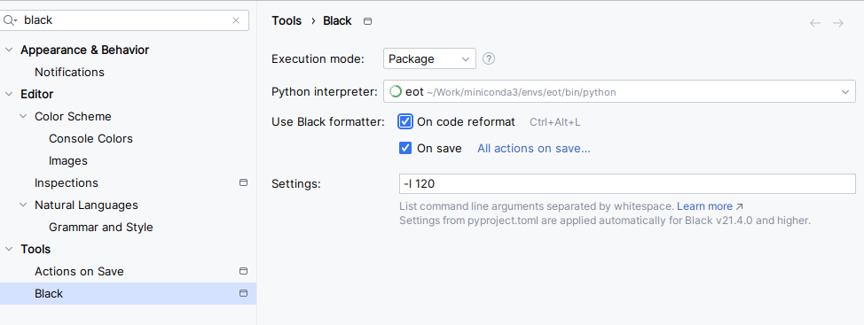
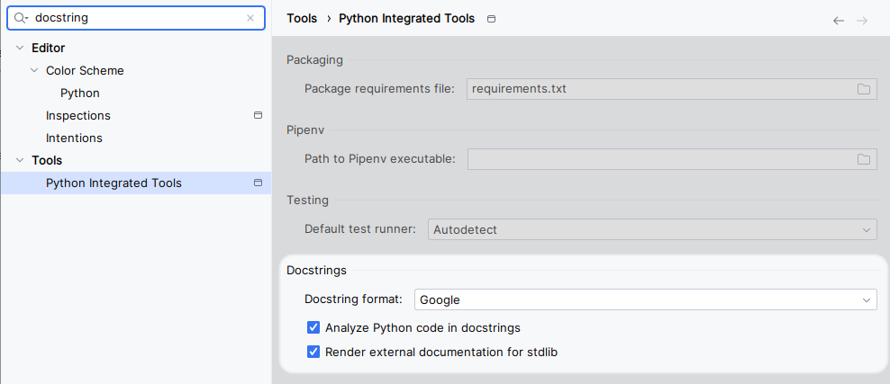

# Setup Guide

This guide outlines the steps to set up the development environment for this project.

## Prerequisites

Before you begin, ensure you have the following:

*   **Python 3.11 or higher:**  The project requires Python 3.11 or a later version. Download the appropriate installer from [python.org](https://www.python.org/downloads/).
*   **A Python Environment Manager:**  You'll need a tool to manage your Python environment and dependencies.  We recommend **Poetry** or **pip** with `virtualenv`, but other tools like `conda`, `uv`, `pipx` are also compatible.
*   **Make (Optional, but Recommended):**  The project includes a `Makefile` to automate common tasks like dependency installation and testing.  While optional, using `make` simplifies the setup process.

## Hardware Acceleration Support

This project provides comprehensive support for multiple hardware acceleration backends to optimize performance across different systems:

### Supported Platforms

* **NVIDIA CUDA** - Full support for NVIDIA GPUs
  * Default: CUDA 12.4
  * Custom versions can be specified in the `pyproject.toml` file by modifying the `pytorch-cuda` poetry source link

* **AMD ROCm** - Optimized for AMD GPUs
  * Default: ROCm 6.2.4
  * Custom versions can be specified in the `pyproject.toml` file by modifying the `pytorch-rocm` poetry source link

* **Apple Silicon (MPS)** - Native acceleration for Apple M1/M2/M3 chips
  * Leverages Metal Performance Shaders for optimal performance

* **CPU-only** - Reliable fallback option
  * Ensures compatibility on systems without supported GPUs or when troubleshooting hardware-specific issues

### Automatic Configuration

The `make install` command intelligently detects your hardware configuration and installs the appropriate acceleration backend without requiring manual intervention.

### Platform Limitations

**Note on Intel GPU Support:**
> Intel discrete GPU support has been temporarily removed due to unresolved dependency conflicts between Intel's libraries and PyTorch 2.6.0. Specifically, there's an incompatibility between the `dpcpp-cpp-rt` package and `torch==2.6.0` that prevents Poetry from resolving dependencies.
> For more details, see Intel's [Troubleshooting Documentation](https://intel.github.io/intel-extension-for-pytorch/xpu/2.6.10+xpu/tutorials/known_issues.html).

**Workaround for Intel GPU users:**
> 1. Install the CPU dependencies using this project's standard installation
> 2. Follow Intel's [official installation guide](https://pytorch-extension.intel.com/installation?platform=gpu&version=v2.3.110%2Bxpu) to manually add Intel GPU support
>
> Intel GPU support will be reintegrated once these dependency conflicts are resolved in future PyTorch versions.


## Installing Make (Recommended)

`make` is a build automation tool. If you choose to use it, follow the instructions below for your operating system:

*   **Windows:**
    1.  Open PowerShell as an administrator.
    2.  Run: `winget install GnuWin32.Make`
    3.  Add the installation directory (typically `C:\Program Files (x86)\GnuWin32\bin`) to your system's `PATH` environment variable.  You can do this by searching for "environment variables" in the Windows search bar, clicking "Edit the system environment variables," then "Environment Variables...", selecting "Path" under "System variables," clicking "Edit," and adding the path.
*   **macOS:**
    1.  Open a terminal.
    2.  Run: `brew install make` (This requires [Homebrew](https://brew.sh/) to be installed).
*   **Linux:** `make` is usually pre-installed on most Linux distributions.  You can verify by running `make --version` in your terminal. If it's not installed, use your distribution's package manager (e.g., `apt-get install make` on Debian/Ubuntu, `yum install make` on Fedora/CentOS).

## Setting Up the Python Environment

### Recommended Method: Using Make

The project provides simple make commands that handle the entire installation process, including hardware detection and appropriate PyTorch backend installation:

1. **For standard installation:**

   ```bash
   make install
   ```

   This command will:
   - Install Poetry if not already installed
   - Detect your hardware (NVIDIA CUDA, AMD ROCm, Apple Silicon, Intel GPU, or CPU-only)
   - Install the appropriate PyTorch backend for your hardware
   - Set up the project environment

2. **For development setup:**

   ```bash
   make install-dev
   ```

   This command does everything the standard installation does, plus:
   - Installs development dependencies
   - Sets up pre-commit hooks
   - Installs testing tools

3. **Run experiments:**

   After installation, you can run experiments using the provided scripts. For example, to run a time series experiment:

   ```bash
   make run-ts
   ```

### Alternative Methods

If you cannot use the make commands for some reason, you can use these alternative approaches:

#### Using the Installation Script Directly

```bash
chmod +x scripts/install.sh  # Make the script executable (Linux/macOS only)
./scripts/install.sh         # Run the standard installation
```

or for development setup:

```bash
./scripts/install.sh --dev   # Install with development dependencies
```

#### Using Poetry Manually

If you need to manually specify a backend:

1. **Install Poetry:**

   ```bash
   pip install --no-cache-dir -U "poetry>=2.1.1"
   poetry config virtualenvs.in-project true --local
   ```

2. **Install dependencies with a specific backend:**

   ```bash
   # For CUDA support
   poetry install --no-cache --with=cuda

   # For ROCm support
   poetry install --no-cache --with=rocm

   # For Apple Silicon (MPS) support
   poetry install --no-cache --with=mps

   # For Intel GPU support
   poetry install --no-cache --with=intel

   # For CPU-only
   poetry install --no-cache --with=cpu
   ```

3. **For development dependencies:**

   ```bash
   poetry install --no-cache --with=dev,cuda  # Replace 'cuda' with your backend
   poetry run pre-commit install
   ```

## Verifying Your Installation

To verify that PyTorch is correctly installed with the appropriate backend:

```bash
poetry run python -c "import torch; print(f'PyTorch version: {torch.__version__}'); print(f'CUDA available: {torch.cuda.is_available()}'); device = torch.device('cuda' if torch.cuda.is_available() else 'mps' if hasattr(torch, 'mps') and torch.mps.is_available() else 'cpu'); print(f'Using device: {device}'); x = torch.rand(5, 3).to(device); print(x)"
```

This command will show your PyTorch version, hardware acceleration availability, and run a simple tensor operation on your detected device.

## Setting Up Automatic Formatting

To automatically format your code according to the project's style (Black), follow these steps:

1.  **Install Development Dependencies:** Ensure you've installed the development dependencies using `make install-dev`. This will install the `black` formatter.

### In PyCharm

2. **Configure PyCharm:**
    *   Open PyCharm settings (File > Settings or Ctrl+Alt+S).
    *   Navigate to "Tools" > "Black".
    *   Check "On code reformat" and "On save".
    *   Set the settings to `-l 120`



### In VSCode

2.  **Configure VS Code:**
    *   Open VS Code settings (File > Preferences > Settings or Ctrl+,).
    *   Search for "Format on Save".
    *   Enable "Editor: Format On Save".
    *   Search for "Python > Formatting: Provider".
    *   Select "black" from the dropdown.
    *   (Optional, but recommended) Search for "Editor: Format On Save Mode" and set it to "modifications" if you only want to format changed lines, or "file" to format the entire file.

## Setting Up Docstring Style (PyCharm)

To ensure consistent docstring formatting (Google style) in PyCharm:

1.  Open PyCharm settings (File > Settings or Ctrl+Alt+S).
2.  Navigate to "Tools" > "Python Integrated Tools".
3.  Under "Docstrings," set "Docstring format" to "Google".



## Pre-commit Hooks

When you run `make install-dev`, pre-commit hooks are automatically installed. These hooks run checks before each commit to ensure code quality.

To manually run the pre-commit checks:

```bash
make lint

# or
poetry run pre-commit run --all-files
```

## Troubleshooting

### Hardware Acceleration Issues

If you're experiencing issues with hardware acceleration:

1. **NVIDIA CUDA:**
   * Ensure you have the latest NVIDIA drivers installed
   * Check that `nvidia-smi` works in your terminal
   * Verify CUDA toolkit is properly installed

2. **AMD ROCm:**
   * Ensure ROCm is properly installed
   * Check that `rocminfo` works in your terminal

3. **Apple Silicon:**
   * Ensure you're using macOS 12.3 or later
   * Make sure you're using Python 3.8 or later

4. **Intel GPU:**
   * Ensure you have the latest Intel graphics drivers
   * Check that the Intel oneAPI Base Toolkit is installed if using SYCL

### Installation Errors

If the installation fails:

1. Check the output for specific error messages
2. Try running with verbose output: `make -n install` to see what commands would be executed
3. If Poetry installation is failing, try installing it manually first
4. For hardware detection issues, try specifying the backend manually:
   ```bash
   make poetry-install backend=cpu  # Replace 'cpu' with your desired backend
   ```

For further assistance, please open an issue on the project repository.
